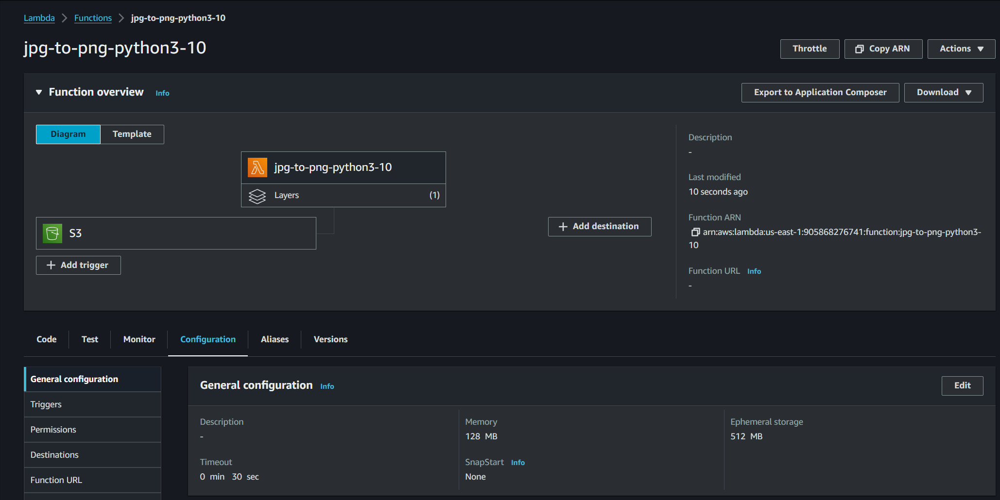
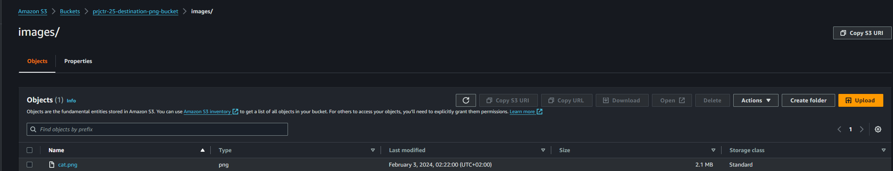

# JPEG to PNG Conversion Lambda Function

This project contains an AWS Lambda function designed to convert JPEG images to PNG format. Upon receiving a new JPEG image in the source S3 bucket, the Lambda function is triggered, converts the image to PNG format, and uploads the converted image to the destination S3 bucket.

## Setup and Deployment

### Prerequisites

- AWS Account
- AWS CLI installed and configured
- Python 3.10 installed (if testing locally)

### Step 1: Create S3 Buckets

1. Create two S3 buckets:
   - **Source Bucket**: To store the original JPEG images.
   - **Destination Bucket**: To store the converted PNG images.

### Step 2: Deploy Lambda Function

1. Navigate to the AWS Lambda Console.
2. Create a new Lambda function with Python 3.10 runtime.
3. Assign the IAM role created in Step 1.
4. Upload the Lambda function code.

### Step 3: Add Trigger

1. Configure an S3 trigger on the source bucket to invoke the Lambda function upon the upload of new JPEG images.

## Function Code

```python
import boto3
from PIL import Image
import io

s3 = boto3.client('s3')

def lambda_handler(event, context):
    # Get bucket and key from the event
    source_bucket = event['Records'][0]['s3']['bucket']['name']
    key = event['Records'][0]['s3']['object']['key']
    destination_bucket = 'prjctr-25-destination-png-bucket'

    # Remove .jpg from the key and append .png
    new_key = key.rsplit('.', 1)[0] + '.png'

    # Get the image
    file_byte_string = s3.get_object(Bucket=source_bucket, Key=key)['Body'].read()

    # Convert image to PNG
    image = Image.open(io.BytesIO(file_byte_string))
    buffer = io.BytesIO()
    image.save(buffer, format="PNG")
    buffer.seek(0)

    # Upload the converted image
    s3.put_object(Bucket=destination_bucket, Key=new_key, Body=buffer, ContentType='image/png')

    return {'statusCode': 200, 'body': 'Image converted and uploaded successfully'}
```

## Configuration and Permissions

### Lambda Function

- **Runtime**: `Python 3.10`
- **Handler**: `lambda_function.lambda_handler`
- **Memory**: `128 Mb`
- **Timeout**: `30 s`



### IAM Role Permissions

- S3 read access to the source bucket 
- S3 write access to the destination bucket 
- CloudWatch logs write access 

### S3 Trigger

- **Event type**: PUT
- **Prefix**: `images/`


## Testing and Logs

1. Upload a JPEG image to the source bucket. 
2. Check the destination bucket for the converted PNG image. 
3. Review execution logs in CloudWatch for any errors or information. 

